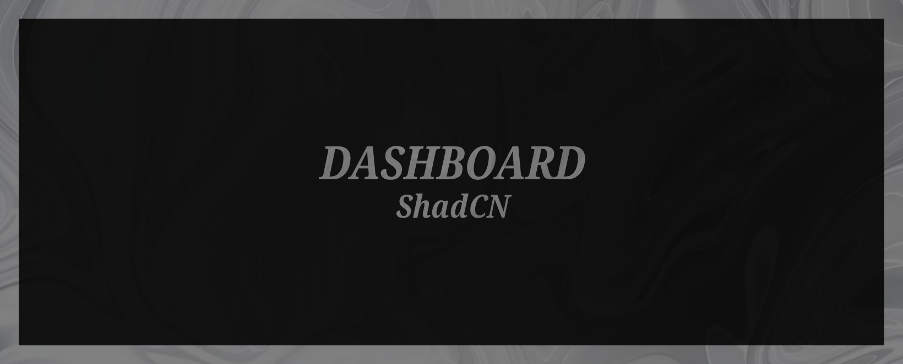

# Dashboard ShadCN

Dashboard ShadCN is a simple, minimalistic frontend project designed to explore and learn the fundamentals of building user interfaces with ShadCN. The dashboard serves as a foundation for understanding component-based design and integration of modern frontend technologies.

## Features
- **Basic Dashboard Layout**: Includes essential UI components for a functional dashboard.
- **Learning Tool**: Ideal for experimenting with ShadCN and Tailwind CSS.
- **Responsive Design**: Built with mobile-first principles to ensure compatibility across devices.

---

## Technologies Used
<table align="left">
  <tr>
    <td align="center">
      <a href="https://developer.mozilla.org/en-US/docs/Web/HTML/">
         
        <b>HTML</b>
      </a>
    </td>
    <td align="center">
      <a href="https://reactjs.org/">
         
        <b>React</b>
      </a>
    </td>
    <td align="center">
      <a href="https://nextjs.org/">
         
        <b>Next.js</b>
      </a>
    </td>
  </tr>
  <tr>
    <td align="center">
      <a href="https://tailwindcss.com/">
         
        <b>Tailwind CSS</b>
      </a>
    </td>
    <td align="center">
      <a href="https://ui.shadcn.dev/">
         
        <b>ShadCN</b>
      </a>
    </td>
  </tr>
</table>

       
   

---

## Live Demo
Experience the dashboard at [Dashboard ShadCN](dashboard-shadcn-nine.vercel.app).
